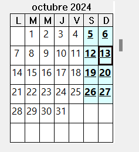

# PLAN DE GESTIÓN DEL CRONOGRAMA

- **NOMBRE DEL PROYECTO:** Pueblista: Diseño, desarrollo e implantación de una aplicación web para la reserva de espacios públicos en pequeños municipios andaluces
- **CÓDIGO DEL PROYECTO:** 2.15
- **FECHA DE CREACIÓN:** 22/10/2024
- **VERSIÓN DEL DOCUMENTO:** 1.0

 

 

**HISTÓRICO DE MODIFICACIONES DEL DOCUMENTO**

|Fecha	|Realizada por	|Breve descripción de los cambios |
| ----- | ------------- | ----------------- |
|22/10/2024	| Ramón Gavira Sánchez|	Elaboración de la primera versión del documento |

\newpage

# METODOLOGÍA EN LOS PROCESOS

## Definir las actividades

El proyecto Pueblista tiene identificadas cuatro fases principales: **Inicio, Planificación, Ejecución y Cierrre**, que se desglosan en actividades y entregables específicos dentro de cada fase. Las actividades han sido definidas a partir de los paquetes de trabajo identificados en la **EDT**, asignado un un *ID* que seguirá el formato 
**PUEB01-nºfase.actividad/hito/entregable** para facilitar su seguimiento y control.

| Campo             | Descripción                                                                 |
| ----------------- | --------------------------------------------------------------------------- |
| PUEB01 + **-**           | Identificador del proyecto Pueblista                                        |
| nº de fase + **.**      | Número de fase (01 para Inicio, 02 para Planificación, 03 para Ejecución, 04 para Cierre) |
| actividad         | Identificador de la actividad dentro de la fase                             |
| hito/entregable   | Identificador del hito o entregable específico                              |

Cada actividad tendrá una descripción que detalla sus objetivos y si es necesario, las **predecesoras y antecesoras** estarán claramente identificadas, siguiendo una lógica mayormente de dependencias del tipo **Fin a Comienzo (FC)**, donde una tarea no puede comenzar hasta que la anterior haya finalizado.

## Secuenciar las actividades

Las actividades se secuencian según la lógica de dependencias y los entregables identificados en la **EDT**. El proyecto, al seguir un ciclo de vida predictivo en la mayor parte de sus fases, presenta una estructura donde las dependencias entre tareas están claramente definidas, minimizando las iteraciones y asegurando una ejecución ordenada. 

## Estimar la duración de las actividades

Para la estimación de la duración de las actividades, se ha utilizado una combinación de la técnica de estimación por tres valores de **PERT**. Al no poseer un histórico de proyectos similares, se ha optado por realizar una estimación basada en la experiencia de los miembros del equipo y en la información recopilada durante la fase de planificación, esta técnica ha demostrado ser efectiva en escenarios de incertidumbre. Se solicitan tres estimaciones para cada actividad:

- **Optimista**: Representa el tiempo mínimo en el que se podría completar la actividad en condiciones ideales.
- **Más probable**: Representa el tiempo más probable que se tardaría en completar la actividad, bajo condiciones normales y considerando posibles contratiempos.
- **Pesimista**: Representa el tiempo máximo en condiciones desfavorables.

Esta técnica ha sido complementada con la exigencia de **hitos críticos**, ajustando las fechas según los requerimientos del cliente y los compromisos de entrega, lo que facilita la asignación de plazos estrictos a ciertas actividades clave.

## Desarrollar el cronograma

El cronograma del proyecto Pueblista se ha elaborado tomando en cuenta las dependencias entre actividades, las estimaciones de duración y los hitos críticos. Cada actividad tiene asociada una fecha de inicio y fin, ajustada en función de las estimaciones previamente realizadas y las necesidades del cliente. El cronograma seguirá siendo actualizado y ajustado conforme al progreso real del proyecto, manteniendo la flexibilidad para adaptarse a posibles cambios y desviaciones.

# HERRAMIENTAS PARA LA GESTIÓN DEL CRONOGRAMA

Para la gestión del cronograma se utilizará **Microsoft Project**, que permitirá:

- La elaboración del cronograma del proyecto con todas las actividades, hitos y entregables, proporcionando una vista clara del progreso en relación con la línea base del tiempo.

- El control del progreso de las tareas y la comparación continua contra las líneas base del proyecto, con el objetivo de identificar posibles desviaciones.

- La generación de informes de seguimiento detallados, que facilitarán la toma de decisiones y la comunicación con los *stakeholders*.

Además se integrarán herramientas ágiles como **ZenHub** o similares para gestionar las actividades de la fase de ejución, controlando las tareas específicas de cada iteración, generando informes de desempeño y métricas como la **velocidad** del equipo o el **burndown chart**, que permitirá una visión detallada del trabajo pendiente y el progreso del equipo.

# ESTIMACIONES DE TIEMPO

## Calendario del Proyecto

Dado el contexto del equipo y las necesidades del proyecto, se establece que todos los días del mes serán laborables. Esta deicsión permitirá optimizar el tiempo y cumplir con el cronograma apretado establecido para el proyecto.

El calendario del proyecto definido en **Microsoft Project** se presenta a continuación con este formato:

## Unidades de Medida

- **Días**: Unidad principal para medir la duración de las actividades de las activididades.

Una vez asignados los recursos a las actividades se podrá medir la duración de las mismas en **dias/persona**, permitiendo una gestión efectiva de la carga de trabajo en el equipo.

## Nivel de Precisión

Dada la exigencia del proyecto y los ajustados plazos, no se admitirán retrasos (por parte del equipo) en la fase de *planificación* y *cierre*. En la fase de ejecución reflejando el enfoque de Scrum, aplacaremos la presión de los plazos con la flexibilidad de las iteraciones, permitiendo ajustes en función de los resultados obtenidos en cada sprint, como se detallará más adelante en las reservas de contingencia.

Por este motivo, se establece un nivel de precisión del **95%** en la fase de planificación y cierre, y un **80%** en la fase de ejecución.

## Reservas de contigencia

Se establecerá una reserva de contigencia del 10-15% del tiempo estimado. En la fase de ejecución si las tareas ejecutadas en un sprint no cumplen con las expectativas del *Sprint Goal* y no conseguimos cumplir con el *Hito* correspondiente a tiempo, se permitirán trasladar todas las tareas pendientes al siguiente *Sprint*, dándole prioridad a estas tareas no completadas.

# SEGUIMIENTO Y CONTROL DEL CRONOGRAMA

Durante la fase de ejecución del proyecto, se monitoreará continuamente el avance del cronograma para identificar posibles desviaciones y tomar medidas correctivas de manera oportuna. El seguimiento y control del crongorama se realizará a través de varias herramientas y metodologías para garantizar que el proyecto se mantenga en el camino previsto y se cumplan los plazos acordados

Esto se hará para cada Sprint, analizando el desempeño del equipo y la velocidad del trabajo, comparando los resultados con las estimaciones iniciales y ajustando el cronograma en consecuencia. La fase que podrá verse afectada por desviaciones será la de ejecución, y por consiguiente la de *cierre*. Al inicio del primer Sprint, se realizará una reunión de planificación en la que se definirán todas las tareas a realizar (*Product Backlog*), y se establecerá un *Sprint Backlog* y un *Sprint Goal* para cada iteración al inicio de cada Sprint.

## Métrica de Avance del Cronograma

- **¿Cómo se medirá el porcentaje de avance?**: Para evaluar el avanace del cronograma no usaremos ningún metodo muy complejo, simplemente se compararán los días de retraso o adelanto respecto a la línea base definida al inicio del proyecto. Cada tarea tendrá una estimación y el grueso de todas las tareas deberán cumplir con la estimación de la línea base. Para medir el porcentaje de avance compararemos todas las tareas completadas con las tareas planificadas en la línea base, usando la siguiente fórmula:

$$
\text{Porcentaje de avance} = \frac{\text{Tareas completadas}}{\text{Tareas planificadas}} \times 100
$$

- **Responsables**: El director de proyecto será el encargado de supervisar el cumplimento del crongograma, con apoyo de los responsables de cada tarea y el equipo en su conjunto.

## Cuentas de control de la EDT

Las cuentas de control en la **EDT** se centrarán en los siguientes puntos clave:

- **Hitos clave:** Se utilizarán para medir avances importantes en el proyecto.
- **Entregables:** Se asignarán a cada actividad para garantizar que se cumplan los plazos.
- **Actividades críticas:** Se identificarán y se les asignarán recursos adicionales para garantizar que se completen a tiempo.
- **Fases del proyecto**: Cada fase del proyecto se gestionará como una unidad, con agrupaciones de tareas,hitos y entregables específicos para evaluar el avance global.

## Informes de estado y seguimiento

Se elaborarán informes de estado y seguimiento del cronograma semanalmente, tras el cierre de cada Sprint (semanalmente), para evaluar el progreso del proyecto y detectar posibles desviaciones. Estos informes incluirán:

- **Resumen de actividades completadas**: Se detallarán las actividades completadas en el período y se compararán con las planificadas.
- **Resumen de actividades pendientes**: Se detallarán las actividades pendientes y se identificarán las posibles causas de retraso.
- **Burndown chart**: Se incluirá un gráfico de *burndown* para visualizar el progreso del proyecto y detectar posibles desviaciones.

Estos informes serán compartidos tanto con el equipo como con los clientes para mantener una comunicación transparente, también recogeremos cualquier incidencia, toma de decisiones y acciones correctivas que se hayan llevado a cabo.

## Actualización del cronograma

 La línea base del cronograma será revisada y actualizada al final de cada Sprint, basándose en los resultados obtenidos. Cualquier modificación significativa será discutida en reuniones de control de cambios, asegurando que los clientes y el resto del equipo estén al tanto de los ajustes y su justificación. Los cambios que afecten de manera considerable el cronograma deberán ser validados por el equipo y comunicados de manera formal a todas las partes interesadas.

# ITERACIONES (FASE DE EJECUCIÓN)

Durante la fase de ejecución del proyecto, se realizarán tres sprints, cada uno centrado en completar los paquetes de trabajo correspondientes a los hitos clave. Todas las tareas del sprint estarán alineadas con los hitos definidos, y cualquier tarea fuera del alcance de estos hitos no será priorizada. El éxito de cada sprint estará condicionado a la finalización de los hitos establecidos para esa iteración.

Cada paquete de trabajo identificado en la fase de ejecución en la **EDT** ha sido asignado en forma de *Hito* a su Sprint correspondiente, el criterio de aceptación queda definido en el **Diccionario de la EDT** y se recogerá en el *Sprint Planning* de cada iteración.

 **ITERACIONES**

| **DURACIÓN**                         | **DESCRIPCIÓN, ALCANCE Y ENTREGABLES**                                                                                                                                                                                         |
|--------------------------------------|--------------------------------------------------------------------------------------------------------------------------------------------------------------------------------------------------------------------------------|
| \textbf{Sprint 1: Mock-ups y versión operativa inicial} (del 07/11/2024 al 13/11/2024) | \textbf{Descripción y alcance}: En este sprint, se completarán los \textbf{CRUDs de contenidos}, atendiendo a la mayoría de los requisitos funcionales de urgencia 1. El equipo de diseño será el responsable de entregar prototipos funcionales y mock-ups que aborden estos requisitos. \newline \newline \textbf{Entregables}: \newline - \textbf{PUEB01-3.19 Mock-ups de la aplicación} (10/11/2024) \newline - \textbf{PUEB01-3.20 Primera versión operativa del producto} (13/11/2024) \newline \newline \textbf{Hitos asociados}: \newline - \textbf{PUEB01-3.12 CRUDs de contenidos finalizados} (13/11/2024) |
| \textbf{Sprint 2: Gestión de reservas} (del 14/11/2024 al 20/11/2024) | \textbf{Descripción y alcance}: En este sprint se llevará a cabo la \textbf{gestión de las reservas}, completando la mayoría de los requisitos de urgencia 2. se abordarán los aspectos más críticos relacionados con la gestión de reservas y la disponibilidad de los espacios públicos. \newline \newline \textbf{Entregables}: \newline - \textbf{Segunda versión operativa del producto} (20/11/2024) \newline \newline \textbf{Hitos asociados}: Gestión de las Reservas finalizada (20/11/2024) |
| \textbf{Sprint 3: Requisitos de conducta y accesibilidad} (del 21/11/2024 al 27/11/2024) | \textbf{Descripción y alcance}: Este sprint se centrará en los requisitos de menor prioridad, como los de conducta operativa, accesibilidad y otros criterios a nivel de proyecto y producto. Además, se generarán los \textbf{informes de accesibilidad} y se refinará la aplicación para cumplir los estándares. El equipo también refactorizará y depurará el código según sea necesario. \newline\newline \textbf{Entregables}: \newline - \textbf{PUEB01-3.22 Informes de Accesibilidad (AA)} (25/11/2024) \newline - \textbf{PUEB01-3.23 Última versión operativa del producto} (27/11/2024) \newline\newline \textbf{Hitos asociados}: \newline - \textbf{PUEB01-3.17 Requisitos de conducta operativos} (27/11/2024) |
